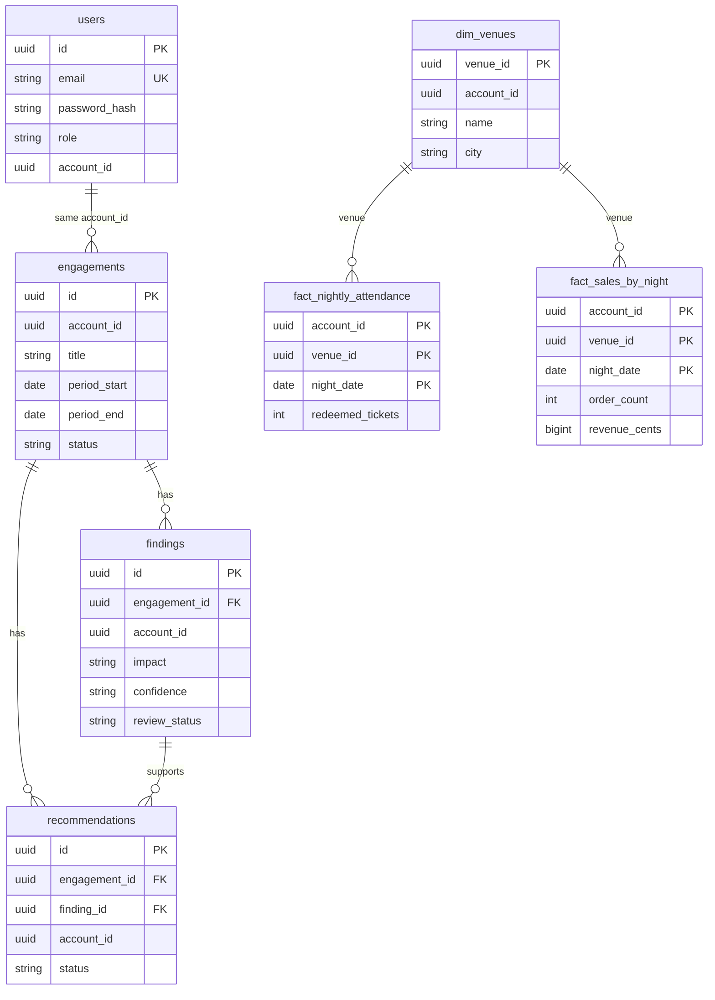

# Modelo de datos — Discover Analytics

## Cómo visualizar la estructura

No hay un plugin MCP de Cursor que introspeccione Postgres y dibuje el ER solo.

| Herramienta | Uso |
|---|---|
| [dbdiagram.io](https://dbdiagram.io) | Importar [`docs/schema.dbml`](schema.dbml) |
| DBeaver / pgAdmin / TablePlus | Conectar a `discover_analytics` y abrir diagrama ER |
| Extensión PostgreSQL (Cursor) | Explorar tablas/columnas |
| Mermaid abajo | Fuente de verdad en el repo |

## Tenant

`account_id` (UUID) es el tenant. En Fase A es un UUID seed fijo (`a1111111-1111-4111-8111-111111111111`). En Fase B se alinea con `accounts.id` / `venues.account_id` de Discover. **Toda** query de negocio filtra por `account_id` del JWT.

## Capas

| Capa | Tablas / objetos | Quién escribe | Qué es |
|---|---|---|---|
| Auth | `analytics.users` | App | Login propio (no customers Pary) |
| Consultoría | `engagements`, `findings`, `recommendations` | App | Metadatos del estudio |
| Hechos seed | `dim_venues`, `fact_nightly_attendance`, `fact_sales_by_night` | Seed / migración | Métricas sin Discover |
| Derivado Discover | `v_nightly_attendance`, `v_sales_by_night` | Solo lectura | Fase B sobre `public` |

`DATA_SOURCE=seed` → repos leen facts. `DATA_SOURCE=discover` → repos leen vistas.

## ER Fase A (`discover_analytics`)

## FKs

- `findings.engagement_id` → `engagements.id`
- `recommendations.engagement_id` → `engagements.id`
- `recommendations.finding_id` → `findings.id` (nullable)
- `fact_*.venue_id` → `dim_venues.venue_id`

No hay FK a Discover en Fase A.

## Seed fijo

| Entidad | UUID |
|---|---|
| account | `a1111111-1111-4111-8111-111111111111` |
| venue A | `b2222222-2222-4222-8222-222222222201` |
| venue B | `b2222222-2222-4222-8222-222222222202` |

Hechos: 14 noches (2026-08-01 … 2026-08-14) × 2 venues.

## Fase B (derivado Discover)

Ver [phase-b-discover.md](phase-b-discover.md). Las vistas viven en `sql/views/` y se aplican sobre la Postgres de Discover; la app no duplica `orders`/`tickets`.
