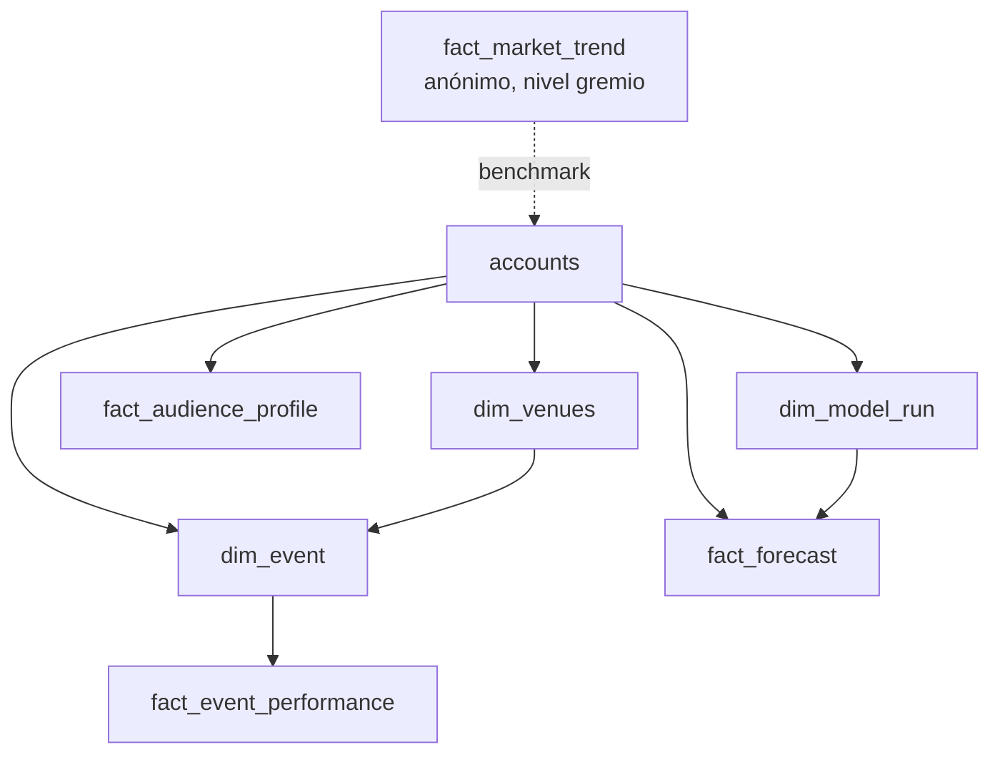

# Modelo de datos objetivo (north-star)

> Documento de dirección, no de estado actual. Describe hacia dónde crece el
> esquema `analytics` para soportar la visión de producto. El estado actual vive
> en [`data-model.md`](data-model.md); la Fase B en [`phase-b-discover.md`](phase-b-discover.md).

## Visión de producto

Una app **amigable para administradores de vida nocturna** (bares, nightclubs,
organizadores de eventos) que **no** son analistas. Tres promesas:

1. **¿Quién es mi público?** — entender la audiencia a partir de Discover.
2. **¿Cómo está el mercado?** — tendencias del gremio, útiles para planear eventos.
3. **¿Qué va a pasar?** — modelos predictivos ("el próximo finde…", "el otro mes…").

Se sirve en apartados visuales digeribles: *próximo fin de semana*, *mis clientes*,
*histórico de eventos*, *tendencias del mercado*.

## Principios de arquitectura (decididos)

1. **Tenant como invariante de base.** Todo dato es por `account_id`, con FK a
   `analytics.accounts` (ver migración `0006`). Cada tabla nueva sigue esta convención.
2. **Audiencia siempre anónima y agregada.** Nunca PII. El "público" se modela como
   distribuciones/segmentos (edad, género, zona, recurrencia), no como personas.
   Coherente con lo gremial ya existente y con Discover como fuente.
3. **Predicción agnóstica al modelo.** La base guarda **resultados** de predicción
   (valor, intervalo, horizonte, versión de modelo, `generated_at`), no ejecuta el
   modelo. El cómputo vive en un job/servicio aparte. Esto respeta la regla de
   `AGENTS.md` (sin agentes de IA / Azure AI Foundry / RAG / loaders externos): un
   modelo predictivo propio con resultados persistidos **no** es un "agente" de esos.
4. **Evento como entidad de primera clase.** `dim_event` da nombre y contexto a las
   noches, habilitando "histórico de eventos" y "próximo finde".
5. **Capa semántica amigable.** Cada objeto visual replica el patrón `MeasureMeta`
   (`app/domain/measures.py`): título + definición en español + `data_quality`.

## Dominios objetivo

### 1. Público / Audiencia (anónimo, agregado)

| Tabla | Grano | Notas |
|---|---|---|
| `fact_audience_profile` | account × periodo × dimensión (edad, género, zona, recurrencia) | Distribuciones, no personas. Alimentada por vistas sobre `public` de Discover en Fase B. |

Dimensiones sugeridas: banda de edad, género (reusar `woman/man/other/undisclosed`),
zona/origen, `nuevo vs recurrente`, ticket promedio.

### 2. Histórico de eventos

| Tabla | Grano | Notas |
|---|---|---|
| `dim_event` | evento | `account_id`, `venue_id`, fecha, nombre, tipo. |
| `fact_event_performance` | evento (× venue) | asistencia, órdenes, revenue, mix de género por evento. |

Relaciona los `fact_*` por-noche existentes con un evento nombrado.

### 3. Tendencias del mercado (anónimo)

| Tabla | Grano | Notas |
|---|---|---|
| `fact_market_trend` | ciudad/segmento × periodo | Extiende `gremial-benchmarks` a series de tendencia anónimas. |

### 4. Predictivo

| Tabla | Grano | Notas |
|---|---|---|
| `dim_model_run` | corrida de modelo | `model_version`, `generated_at`, ventana de entrenamiento. |
| `fact_forecast` | account × entidad (venue/evento) × métrica × horizonte | valor predicho + intervalo de confianza. "Próximo finde" = leer una fila. |

## Fasing sugerido

| Fase | Alcance | Depende de |
|---|---|---|
| **A (hecho)** | FKs `account_id → accounts` + CHECK de rol (backbone de tenant) | migración `0006` |
| **B** | Puente Discover: `DATA_SOURCE=discover`, vistas `v_*`, sembrar `accounts` del tenant | [`phase-b-discover.md`](phase-b-discover.md) |
| **C** | `dim_event` + `fact_event_performance` (histórico de eventos) | A |
| **D** | `fact_audience_profile` (público anónimo) sobre vistas Discover | B |
| **E** | `dim_model_run` + `fact_forecast` (predictivo) | C, D |
| **F** | `fact_market_trend` (tendencias del mercado) | B |

## Preguntas abiertas

- Granularidad temporal de audiencia/tendencias (por noche, semana, mes).
- Definición canónica de "recurrente" (ventana de recompra).
- Umbral mínimo de muestra para publicar un agregado sin re-identificación.
- Métricas y horizontes concretos del primer forecast (tickets del próximo finde?).
